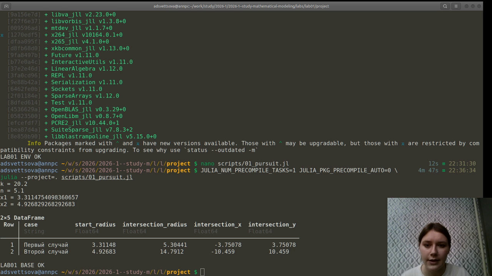
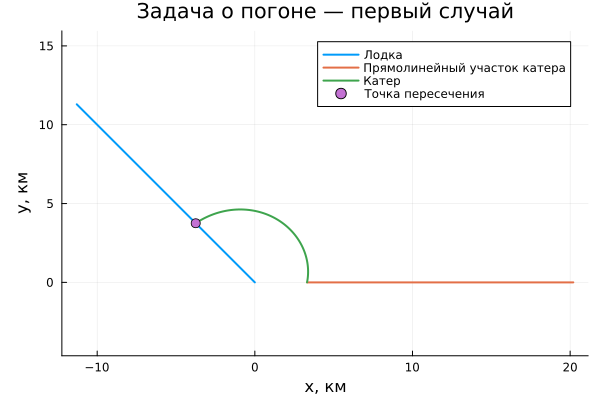
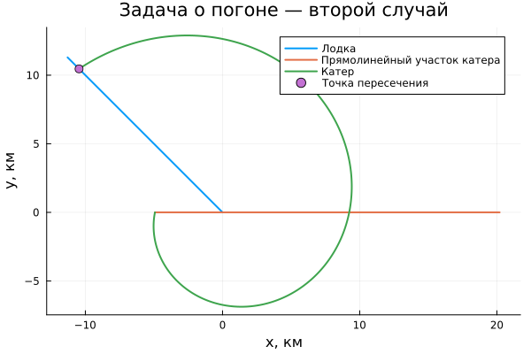
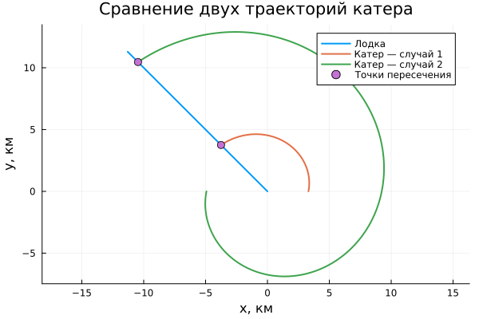
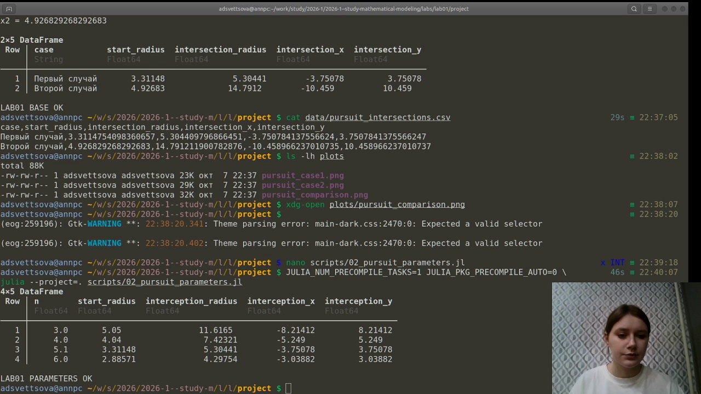
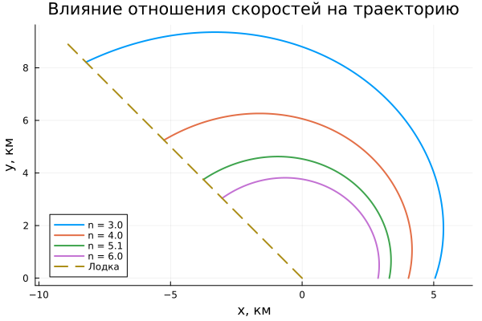
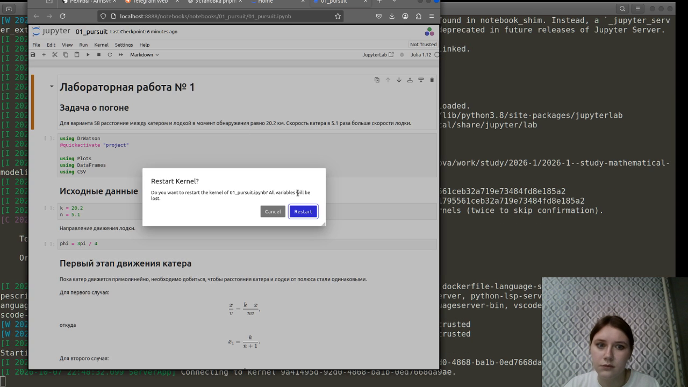

---
## Author
author:
  name: Анна Светцова
  email: 1132230807@pfur.ru
  affiliation:
    - name: Российский университет дружбы народов
      country: Российская Федерация
      postal-code: 117198
      city: Москва
      address: ул. Миклухо-Маклая, д. 6

## Title
title: "Лабораторная работа № 1"
subtitle: "Задача о погоне"
license: CC BY

execute:
  enabled: false
---

# Цель работы

Построить математическую модель задачи о погоне, вывести уравнение движения катера при произвольном отношении скоростей, построить траектории движения катера и лодки для двух начальных случаев и определить точки их пересечения. Дополнительно исследовать влияние отношения скоростей катера и лодки на результат преследования.

# Задание

Для варианта 58 расстояние между катером береговой охраны и лодкой в момент обнаружения равно

$$
k = 20.2\text{ км},
$$

а скорость катера в

$$
n = 5.1
$$

раза больше скорости лодки.

Необходимо:

1. получить уравнение движения катера для общего отношения скоростей $n$;
2. определить начальный радиус для двух возможных случаев расположения катера;
3. построить траектории катера и лодки;
4. определить точки пересечения траекторий;
5. выполнить параметрическое исследование зависимости результата от отношения скоростей;
6. представить вычисления в Julia, Jupyter Notebook и Quarto.

# Теоретическое описание модели

В момент обнаружения лодки принимаем точку её положения за полюс полярной системы координат. Лодка после исчезновения в тумане движется прямолинейно с постоянной скоростью $v$ в некотором направлении $\varphi$.

Скорость катера равна $nv$. Перед началом движения по криволинейной траектории катер должен оказаться на таком же расстоянии от полюса, как лодка.

Для первого начального случая времена движения катера и лодки удовлетворяют условию

$$
\frac{x}{v}=\frac{k-x}{nv},
$$

откуда

$$
x_1=\frac{k}{n+1}.
$$

Для второго случая

$$
\frac{x}{v}=\frac{k+x}{nv},
$$

поэтому

$$
x_2=\frac{k}{n-1}.
$$

Для варианта 58 получаем

$$
x_1=\frac{20.2}{6.1}\approx3.3115\text{ км},
$$

$$
x_2=\frac{20.2}{4.1}\approx4.9268\text{ км}.
$$

После выхода на требуемый радиус радиальная составляющая скорости катера должна совпадать со скоростью лодки:

$$
\frac{dr}{dt}=v.
$$

Тангенциальная составляющая определяется из полной скорости катера:

$$
v_{\tau}=\sqrt{(nv)^2-v^2}=v\sqrt{n^2-1}.
$$

С другой стороны,

$$
v_{\tau}=r\frac{d\theta}{dt}.
$$

После исключения времени получаем дифференциальное уравнение

$$
\frac{dr}{d\theta}=\frac{r}{\sqrt{n^2-1}}.
$$

Его решение имеет вид

$$
r(\theta)=r_0\exp\left(\frac{\theta-\theta_0}{\sqrt{n^2-1}}\right),
$$

то есть траектория катера после прямолинейного участка представляет собой логарифмическую спираль.

# Реализация вычислительного эксперимента

Исходный код оформлен в литературном стиле. В нём задаются параметры варианта, рассчитываются начальные радиусы, строятся траектории в полярных координатах с последующим переходом к декартовым координатам, вычисляются точки пересечения и сохраняются результирующие данные и графики.

На следующем кадре показано успешное выполнение основного вычислительного сценария.

{width=92%}

## Основной эксперимент

Для наглядности направление движения лодки было выбрано равным

$$
\varphi=\frac{3\pi}{4}.
$$

Полученные точки пересечения:

| Случай | Начальный радиус, км | Радиус пересечения, км | $x$, км | $y$, км |
|---|---:|---:|---:|---:|
| 1 | 3.3115 | 5.3044 | -3.7508 | 3.7508 |
| 2 | 4.9268 | 14.7912 | -10.4590 | 10.4590 |

### Первый случай

{width=84%}

В первом случае катер сначала сокращает расстояние по прямой, после чего переходит на логарифмическую спираль и пересекает траекторию лодки на расстоянии приблизительно $5.30$ км от полюса.

### Второй случай

{width=84%}

Во втором случае из-за другого начального положения катеру требуется более длинный участок движения по спирали. Пересечение происходит на расстоянии приблизительно $14.79$ км от полюса.

### Сравнение двух случаев

{width=84%}

Сравнение показывает, что при одинаковых параметрах варианта начальная конфигурация существенно влияет на длину траектории и положение точки перехвата.

# Параметрическое исследование

Для исследования влияния преимущества катера по скорости были рассмотрены значения

$$
n\in\{3.0,4.0,5.1,6.0\}.
$$

Результаты приведены в таблице.

| $n$ | $x_1$, км | Радиус пересечения, км | $x$, км | $y$, км |
|---:|---:|---:|---:|---:|
| 3.0 | 5.0500 | 11.6165 | -8.2141 | 8.2141 |
| 4.0 | 4.0400 | 7.4232 | -5.2490 | 5.2490 |
| 5.1 | 3.3115 | 5.3044 | -3.7508 | 3.7508 |
| 6.0 | 2.8857 | 4.2975 | -3.0388 | 3.0388 |

{width=92%}

{width=84%}

При увеличении отношения скоростей $n$ начальный радиус $x_1$ уменьшается, а точка перехвата располагается ближе к полюсу. Следовательно, увеличение скоростного преимущества катера позволяет раньше пересечь траекторию лодки.

# Литературное программирование и воспроизводимость

Из исходных файлов автоматически были сформированы чистый Julia-код, Jupyter Notebook и Quarto-документация для основного и параметрического экспериментов.

Основной эксперимент:



Параметрический эксперимент:



Сгенерированные Jupyter Notebook были выполнены в отдельном ядре проекта. На кадре ниже показан запуск notebook для лабораторной работы.

{width=92%}

# Результаты

В ходе работы:

- выведено дифференциальное уравнение движения катера при произвольном отношении скоростей $n$;
- показано, что криволинейная часть траектории является логарифмической спиралью;
- рассчитаны два возможных начальных радиуса для варианта 58;
- построены траектории катера и лодки для двух случаев;
- определены точки пересечения траекторий;
- проведено параметрическое исследование влияния отношения скоростей;
- расчёты представлены в Julia, Jupyter Notebook и Quarto.

# Вывод

Математическая модель показывает, что для гарантированного перехвата катер должен сначала выйти на одинаковое с лодкой расстояние от точки её первоначального обнаружения, а затем двигаться по логарифмической спирали. Для варианта 58 при отношении скоростей $n=5.1$ обе рассмотренные начальные конфигурации приводят к пересечению траекторий. Параметрическое исследование показывает, что увеличение скорости катера относительно скорости лодки уменьшает расстояние до точки перехвата и делает преследование более эффективным.
