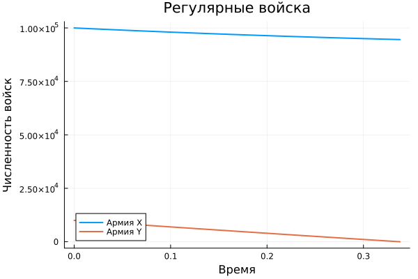
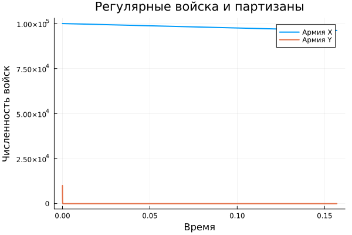
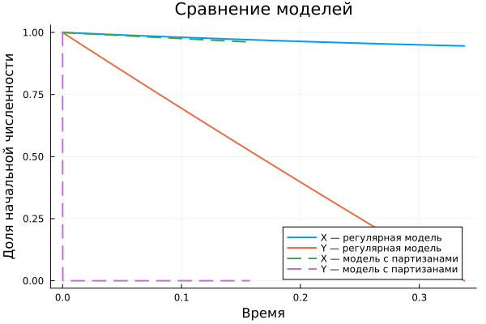
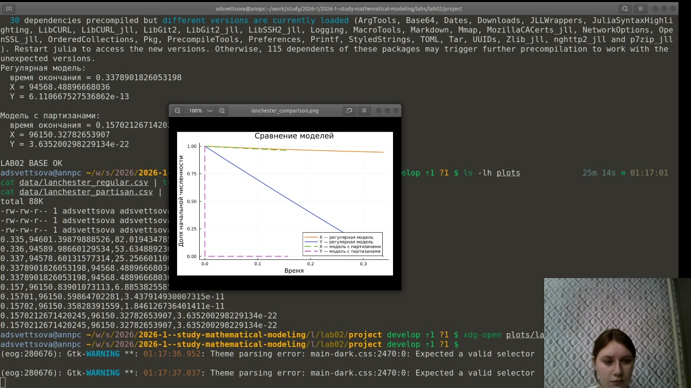
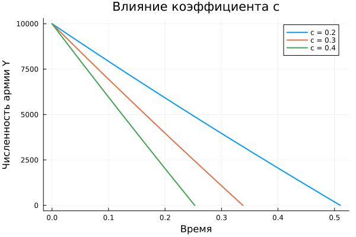
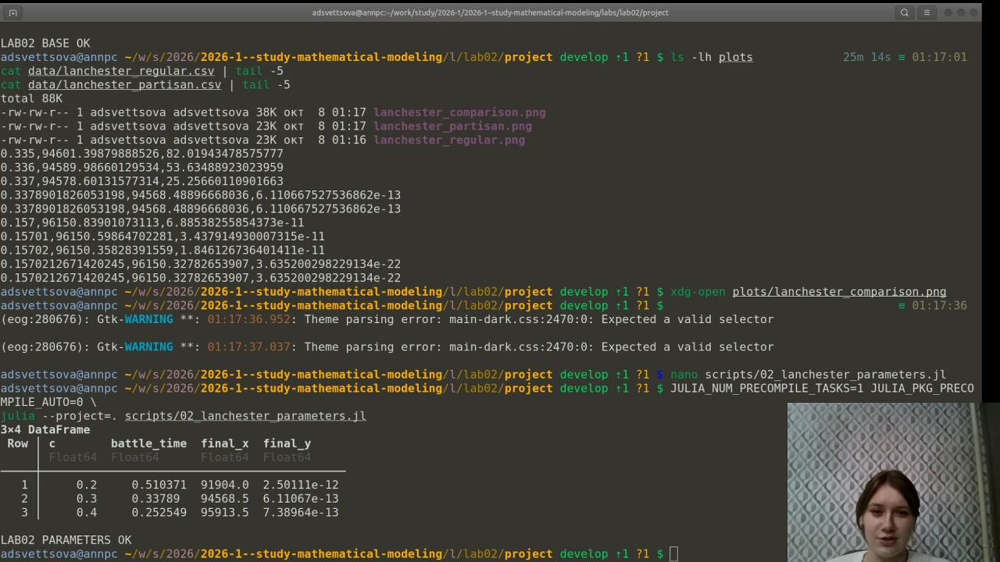
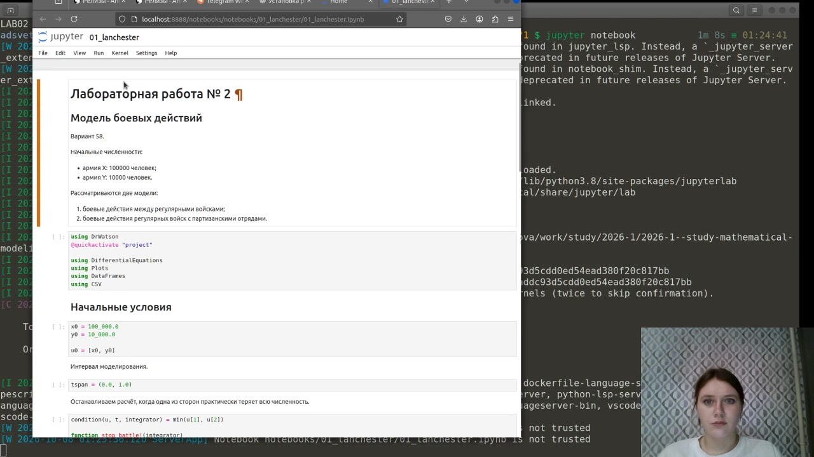
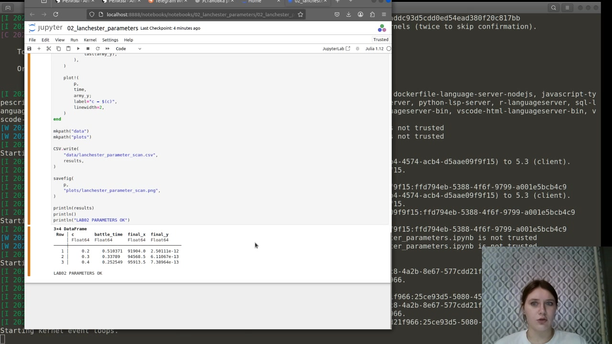

---
## Author
author:
  name: Анна Светцова
  email: 1132230807@pfur.ru
  affiliation:
    - name: Российский университет дружбы народов
      country: Российская Федерация
      postal-code: 117198
      city: Москва
      address: ул. Миклухо-Маклая, д. 6

## Title
title: "Лабораторная работа № 2"
subtitle: "Модель боевых действий"
license: CC BY

execute:
  enabled: false
---

# Цель работы

Исследовать простейшие модели боевых действий Ланчестера, реализовать численное решение систем дифференциальных уравнений для варианта 58, сравнить динамику двух моделей и провести параметрическое исследование влияния эффективности боевых действий на исход противостояния.

# Задание

Для варианта 58 начальные численности сторон составляют

$$
x(0)=100000, \qquad y(0)=10000.
$$

Необходимо построить графики изменения численности войск для двух случаев:

1. боевые действия между регулярными войсками;
2. боевые действия регулярных войск с партизанскими отрядами.

Дополнительно исследуется влияние коэффициента $c$, характеризующего эффективность действий армии $X$ против армии $Y$.

# Теоретические сведения

## Модель регулярных войск

Численности противоборствующих сторон обозначаются $x(t)$ и $y(t)$. Для варианта 58 система имеет вид

$$
\frac{dx}{dt}=-0.12x-0.9y+\sin(t),
$$

$$
\frac{dy}{dt}=-0.3x-0.1y+\cos(t).
$$

Линейные слагаемые описывают собственные потери и потери от действий противника, а функции $\sin(t)$ и $\cos(t)$ задают поступление подкреплений.

## Модель регулярных войск и партизанских отрядов

Во втором случае система записывается как

$$
\frac{dx}{dt}=-0.25x-0.96y+\sin(2t)+1,
$$

$$
\frac{dy}{dt}=-0.25xy-0.3y+\cos(20t)+1.
$$

Главное отличие второй модели состоит в наличии произведения $xy$ во втором уравнении. Потери партизанской стороны зависят одновременно от численности регулярной армии и численности самих партизанских отрядов.

# Реализация

Для численного решения использован язык Julia и пакет `DifferentialEquations.jl`. Система задаётся как задача `ODEProblem` и решается методом `Tsit5`. Расчёт останавливается при достижении одной из сторон нулевой численности.

Результаты сохраняются в CSV-файлы, а графики — в каталог `plots`.

# Основной вычислительный эксперимент

## Регулярные войска

По результатам расчёта противостояние заканчивается приблизительно при

$$
t \approx 0.338.
$$

К этому моменту численность армии $Y$ практически обращается в нуль, а у армии $X$ остаётся около $94568$ человек.

{width=84%}

## Регулярные войска и партизанские отряды

Для второй модели завершение происходит значительно раньше:

$$
t \approx 0.157.
$$

Численность стороны $Y$ также практически обращается в нуль, а у стороны $X$ остаётся около $96150$ человек.

{width=84%}

## Сравнение моделей

Для наглядного сравнения численности нормированы относительно начальных значений.

{width=84%}

Во второй модели сторона $Y$ теряет численность значительно быстрее. Это связано с нелинейным членом $xy$, который резко увеличивает интенсивность потерь при больших значениях численностей.

Скриншот успешного выполнения основного эксперимента и построенного сравнительного графика:

{width=92%}

# Параметрическое исследование

Исследуется коэффициент $c$ регулярной модели:

$$
c \in \{0.2,\ 0.3,\ 0.4\}.
$$

При этом остальные параметры и начальные условия сохраняются неизменными.

Получены следующие результаты:

| $c$ | Время окончания | Итоговая численность $X$ |
|---:|---:|---:|
| 0.2 | 0.510 | 91904 |
| 0.3 | 0.338 | 94569 |
| 0.4 | 0.253 | 95914 |

Во всех трёх случаях численность армии $Y$ к моменту окончания практически равна нулю. При увеличении $c$ противостояние заканчивается быстрее, а у армии $X$ остаётся больше личного состава.

{width=84%}

Результат параметрического расчёта в терминале:

{width=92%}

# Литературное программирование

Основной и параметрический сценарии оформлены в литературном стиле. С помощью `Literate.jl` из исходных файлов автоматически сформированы:

- чистый Julia-код;
- Jupyter Notebook;
- документация в формате Quarto.

Сгенерированные Quarto-документы интегрируются в отчёт непосредственно из каталога проекта.

## Основная модель



## Параметрическое исследование



# Выполнение Jupyter Notebook

Оба сгенерированных notebook были выполнены в отдельном Julia-окружении лабораторной работы.

Основной эксперимент:

{width=92%}

Параметрический эксперимент после выполнения:

{width=92%}

# Результаты

В ходе лабораторной работы:

- реализованы две модели боевых действий для варианта 58;
- численно решены соответствующие системы дифференциальных уравнений;
- построены графики изменения численностей армий;
- выполнено сравнение моделей;
- проведено параметрическое исследование коэффициента эффективности $c$;
- сформированы воспроизводимые Julia-, Jupyter- и Quarto-версии вычислений.

# Вывод

Модели Ланчестера позволяют исследовать влияние начальной численности, эффективности боевых действий и структуры потерь на динамику противостояния. В рассматриваемом варианте армия $X$ имеет существенное начальное преимущество и сохраняет положительную численность в обеих моделях. Нелинейная модель с участием партизанских отрядов приводит к значительно более быстрому уменьшению численности стороны $Y$. Параметрическое исследование показывает, что увеличение коэффициента $c$ сокращает время противостояния и увеличивает остаточную численность армии $X$.
