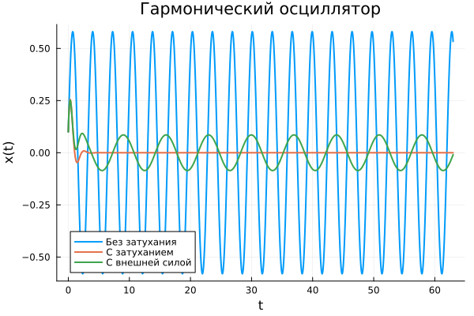
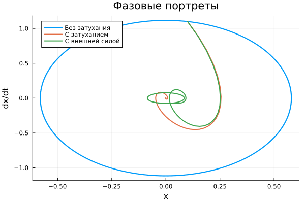
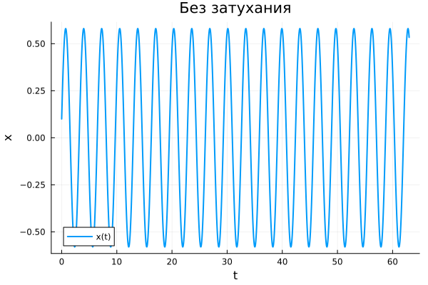
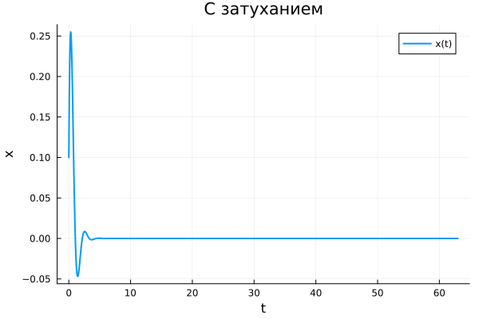
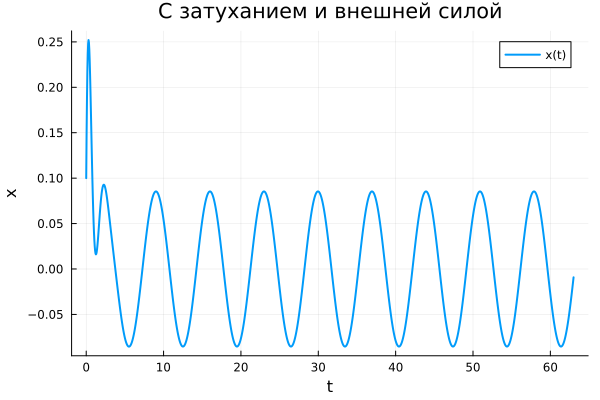
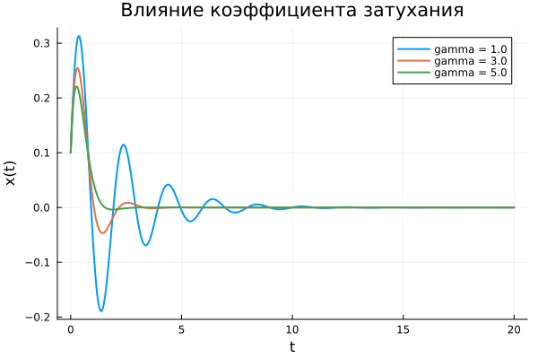

---
author:
  - name: Анна Светцова
    email: 1132230807@pfur.ru
    affiliation:
      - name: Российский университет дружбы народов
title: "Лабораторная работа № 3"
subtitle: "Модель гармонических колебаний"
license: CC BY
date: today
date-format: "YYYY-MM-DD"
---

# Информация

## Докладчик

**Анна Светцова**

Российский университет дружбы народов

1132230807@pfur.ru

# Вводная часть

## Актуальность

- Гармонический осциллятор — базовая модель колебательных процессов
- Затухание изменяет характер движения и приводит к потере энергии
- Внешняя периодическая сила формирует вынужденные колебания
- Численное моделирование позволяет сравнить режимы одной системы

## Цель работы

Исследовать гармонический осциллятор в трёх режимах:

- без затухания и внешней силы;
- с затуханием;
- с затуханием и внешней периодической силой.

Дополнительно исследовать влияние коэффициента затухания.

# Постановка задачи

## Исходные данные

Для варианта 58:

- $t \in [0;63]$;
- шаг $0.05$;
- $x(0)=0.1$;
- $x'(0)=1.1$.

Исследуются три дифференциальных уравнения второго порядка.

## Без затухания

$$
x''+3.7x=0.
$$

В системе отсутствуют потери энергии и внешнее воздействие.

## С затуханием

$$
x''+3x'+10x=0.
$$

Член $3x'$ описывает диссипацию энергии.

## С внешней силой

$$
x''+3x'+11x=0.9\sin(0.9t).
$$

Периодическая внешняя сила поддерживает вынужденное движение системы.

# Математическая модель

## Переход к системе первого порядка

Вводится скорость

$$
v=x'.
$$

Тогда уравнение второго порядка преобразуется в систему:

$$
\frac{dx}{dt}=v,
$$

$$
\frac{dv}{dt}=F(t)-\gamma v-\omega_0^2x.
$$

Эта система решается численно методом `Tsit5`.

# Основной эксперимент

## Сравнение трёх режимов

{width=82%}

Без затухания амплитуда сохраняется, при затухании уменьшается, а внешняя сила поддерживает вынужденные колебания.

## Фазовые портреты

{width=82%}

Фазовые траектории наглядно показывают различие трёх режимов.

## Без затухания

{width=80%}

Колебания сохраняют амплитуду на всём интервале моделирования.

## С затуханием

{width=80%}

Амплитуда быстро уменьшается, система приближается к положению равновесия.

## С затуханием и внешней силой

{width=80%}

После переходного процесса остаётся движение, поддерживаемое периодическим воздействием.

# Параметрическое исследование

## Изменяемый параметр

Исследуется уравнение

$$
x''+\gamma x'+10x=0
$$

при

$$
\gamma \in \{1,\;3,\;5\}.
$$

Все остальные начальные условия сохраняются.

## Влияние коэффициента затухания

{width=82%}

При увеличении $\gamma$ колебания подавляются быстрее.

# Воспроизводимость

## Организация вычислений

- исходный код оформлен в литературном стиле;
- сформированы Julia-скрипты;
- созданы Jupyter Notebook;
- создана Quarto-документация;
- основной и параметрический notebooks выполнены;
- результаты сохранены в CSV и PNG.

# Результаты

## Основные результаты

- исследованы три режима гармонического осциллятора;
- построены временные зависимости;
- построены фазовые портреты;
- показано влияние затухания;
- исследовано внешнее периодическое воздействие;
- выполнено параметрическое исследование коэффициента $\gamma$.

# Итоги

## Вывод

При отсутствии затухания система совершает незатухающие периодические колебания.

Диссипация приводит к уменьшению амплитуды и переходу к равновесию.

Периодическая внешняя сила поддерживает вынужденное движение.

Увеличение коэффициента затухания ускоряет подавление колебаний.
