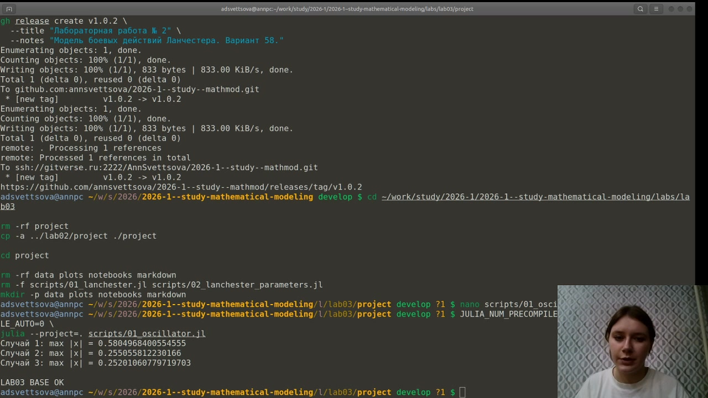
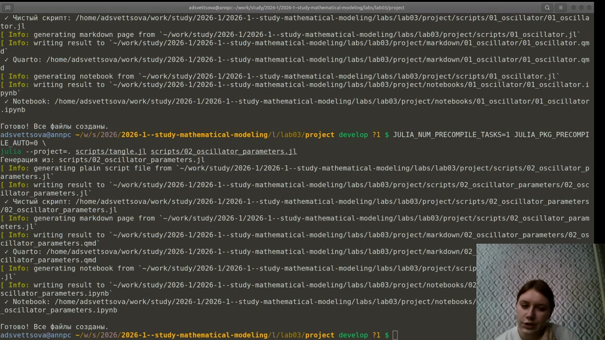
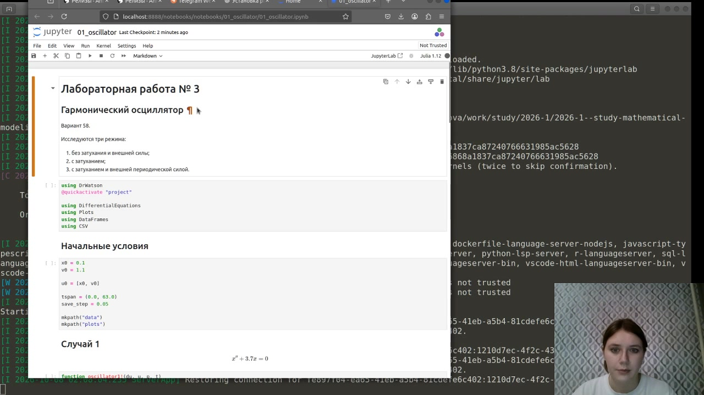
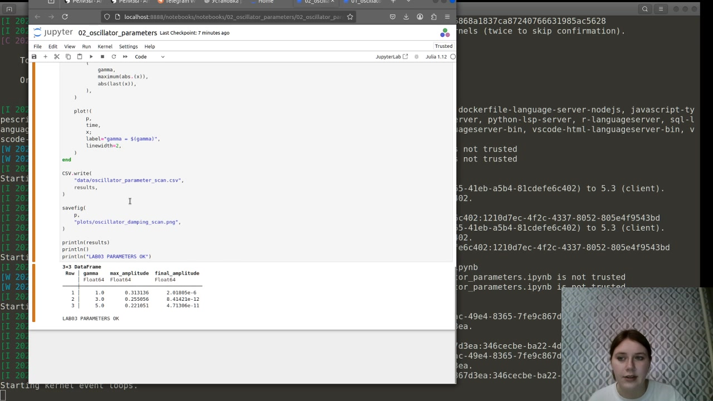

---
## Author
author:
  name: Анна Светцова
  email: 1132230807@pfur.ru
  affiliation:
    - name: Российский университет дружбы народов
      country: Российская Федерация
      postal-code: 117198
      city: Москва
      address: ул. Миклухо-Маклая, д. 6

## Title
title: "Лабораторная работа № 3"
subtitle: "Модель гармонических колебаний"
license: CC BY

execute:
  enabled: false
---

# Цель работы

Исследовать гармонический осциллятор в трёх режимах: без затухания и внешней силы, с затуханием без внешнего воздействия и с затуханием при наличии периодической внешней силы. Построить решения и фазовые портреты, а также выполнить параметрическое исследование влияния коэффициента затухания.

# Задание

Для варианта 58 необходимо исследовать следующие уравнения.

Без затухания и внешней силы:

$$
x'' + 3.7x = 0.
$$

С затуханием и без внешней силы:

$$
x'' + 3x' + 10x = 0.
$$

С затуханием и внешней периодической силой:

$$
x'' + 3x' + 11x = 0.9\sin(0.9t).
$$

Расчёт выполняется на интервале

$$
t \in [0;63]
$$

с шагом $0.05$ и начальными условиями

$$
x(0)=0.1,\qquad x'(0)=1.1.
$$

# Теоретические сведения

Гармонический осциллятор описывается дифференциальным уравнением второго порядка. В общем виде модель можно записать как

$$
x'' + \gamma x' + \omega_0^2 x = F(t),
$$

где $x(t)$ — координата, $\gamma$ — коэффициент затухания, $\omega_0$ — собственная частота системы, а $F(t)$ — внешняя сила.

Для численного решения уравнение второго порядка преобразуется в систему двух уравнений первого порядка. Если обозначить

$$
v=x',
$$

то получаем

$$
\frac{dx}{dt}=v,
$$

$$
\frac{dv}{dt}=F(t)-\gamma v-\omega_0^2x.
$$

Именно эта форма использована в программе.

## Осциллятор без затухания

Для первого случая

$$
x''+3.7x=0.
$$

Здесь отсутствуют и диссипативный член, и внешнее воздействие. Поэтому энергия идеальной системы сохраняется, а решение представляет собой незатухающие периодические колебания.

## Осциллятор с затуханием

Во втором случае

$$
x''+3x'+10x=0.
$$

Член $3x'$ приводит к рассеянию энергии. Амплитуда колебаний со временем уменьшается, а фазовая траектория стягивается к положению равновесия.

## Осциллятор с внешней силой

В третьем случае

$$
x''+3x'+11x=0.9\sin(0.9t).
$$

Периодическая внешняя сила непрерывно передаёт системе энергию. После затухания переходного процесса движение определяется совместным действием диссипации и внешнего возбуждения.

# Реализация вычислительного эксперимента

Для решения систем использован пакет `DifferentialEquations.jl` и метод `Tsit5`. Для всех трёх вариантов применены одинаковые начальные условия и один временной интервал. Результаты сохраняются в CSV, а графики — в PNG.

На скриншоте показан успешный запуск основного вычислительного эксперимента.

{width=92%}

Программа завершилась сообщением `LAB03 BASE OK`. Получены следующие максимальные абсолютные отклонения:

| Случай | $\max |x|$ |
|---|---:|
| Без затухания | 0.5804968400554555 |
| С затуханием | 0.255055812230166 |
| С внешней силой | 0.25201060779719703 |

# Результаты основного эксперимента

## Временные зависимости

На одном графике сравниваются решения всех трёх уравнений.

{width=88%}

В первом случае колебания сохраняют амплитуду. Во втором случае колебания быстро затухают. В третьем случае после переходного процесса сохраняется вынужденная составляющая движения, связанная с периодической внешней силой.

## Фазовые портреты

{width=88%}

Для незатухающего осциллятора фазовая траектория замкнута. При наличии затухания траектория приближается к положению равновесия. При внешнем периодическом воздействии после переходного процесса устанавливается вынужденное движение.

## Отдельные режимы

### Без затухания

{width=84%}

Колебания имеют постоянную амплитуду, что соответствует отсутствию потерь энергии.

### С затуханием

{width=84%}

Амплитуда быстро уменьшается, и система приближается к состоянию равновесия.

### С затуханием и внешней силой

{width=84%}

После затухания переходной составляющей остаётся движение, поддерживаемое внешним периодическим воздействием.

# Параметрическое исследование

Дополнительно исследовано влияние коэффициента затухания $\gamma$ в модели

$$
x''+\gamma x'+10x=0.
$$

Использованы значения

$$
\gamma \in \{1,\;3,\;5\}.
$$

Для каждого значения задача решается заново с одинаковыми начальными условиями.

{width=88%}

Чем больше коэффициент затухания, тем быстрее уменьшается амплитуда и тем быстрее система теряет энергию.

Полученные численные характеристики:

| $\gamma$ | Максимальная амплитуда | Финальная амплитуда |
|---:|---:|---:|
| 1.0 | 0.313136 | $2.01805\cdot10^{-6}$ |
| 3.0 | 0.255056 | $8.41421\cdot10^{-12}$ |
| 5.0 | 0.221051 | $4.71306\cdot10^{-11}$ |

# Литературное программирование

Исходный код оформлен в литературном стиле и содержит одновременно программную реализацию и описание математической модели.

Из каждого литературного исходника автоматически сформированы:

- чистый Julia-код;
- Jupyter Notebook;
- Quarto-документация.

На скриншоте показана успешная генерация производных форматов.

{width=92%}

# Выполнение Jupyter Notebook

Основной notebook был выполнен в отдельном Julia-окружении лабораторной работы.

{width=92%}

Также выполнен notebook параметрического исследования.

{width=92%}

Таким образом, основной и параметрический вычислительные эксперименты воспроизводятся не только из исходных Julia-скриптов, но и из сгенерированных Jupyter Notebook.

# Документация Quarto

Ниже подключена автоматически сгенерированная документация основного эксперимента.



Ниже подключена документация параметрического исследования.



# Результаты

В ходе выполнения лабораторной работы:

- реализованы три режима гармонического осциллятора;
- построены временные зависимости координаты;
- построены фазовые портреты;
- показано влияние затухания на динамику системы;
- исследована модель с внешней периодической силой;
- выполнено параметрическое исследование коэффициента затухания;
- результаты сохранены в табличном и графическом виде;
- из литературного кода созданы Julia, Jupyter и Quarto-представления;
- оба Jupyter Notebook успешно выполнены.

# Вывод

В работе исследованы три режима гармонического осциллятора. При отсутствии затухания система совершает незатухающие периодические колебания. При введении диссипативного члена амплитуда уменьшается, а система стремится к положению равновесия. Периодическая внешняя сила поддерживает вынужденное движение после затухания переходного процесса.

Параметрическое исследование показало, что коэффициент затухания существенно влияет на скорость снижения амплитуды: увеличение $\gamma$ приводит к более быстрому подавлению колебательного процесса.
