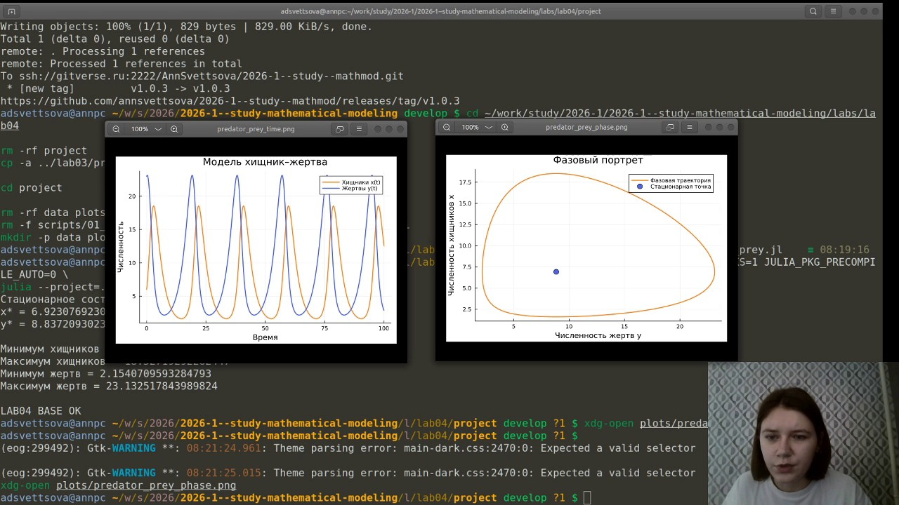
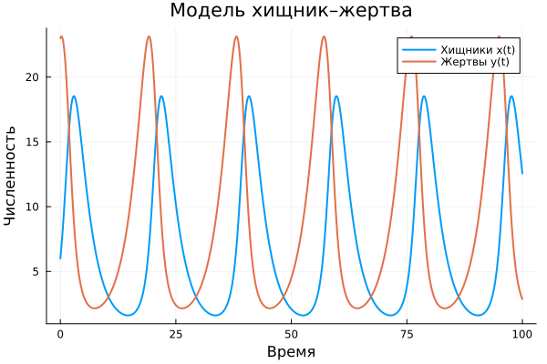
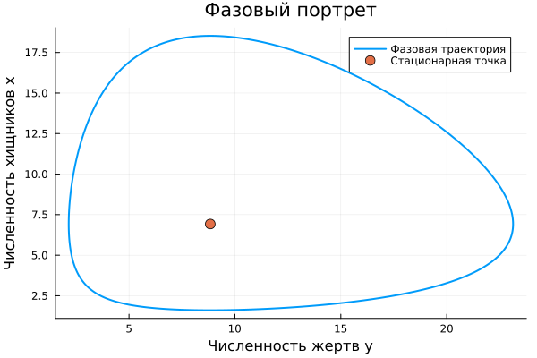
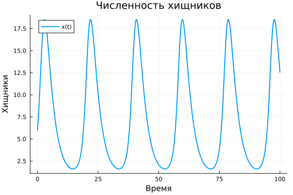
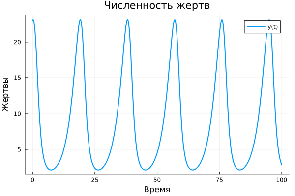
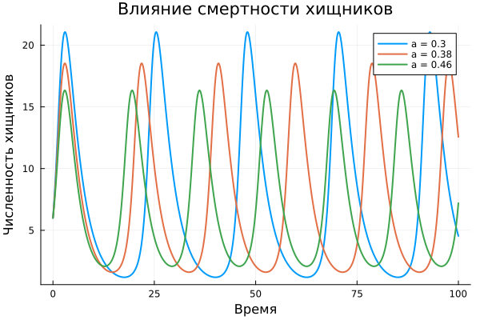
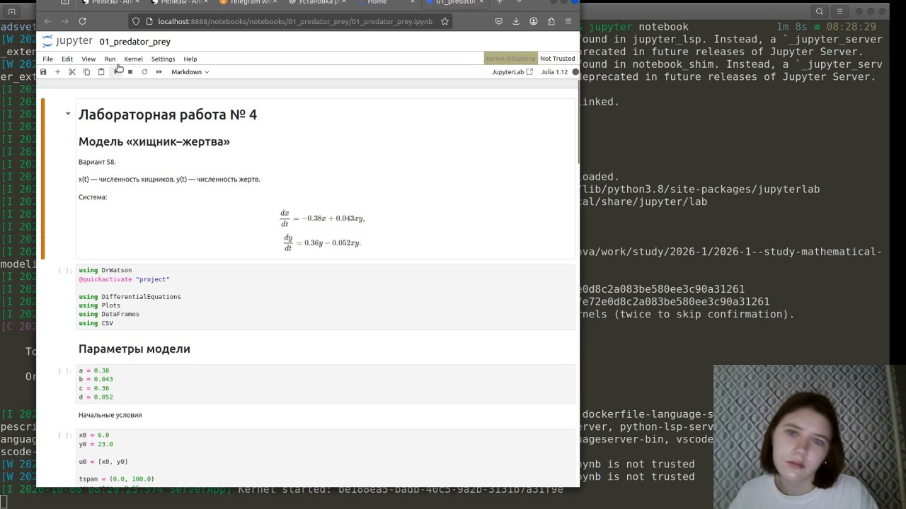
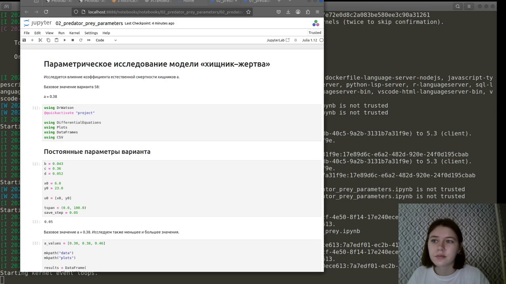
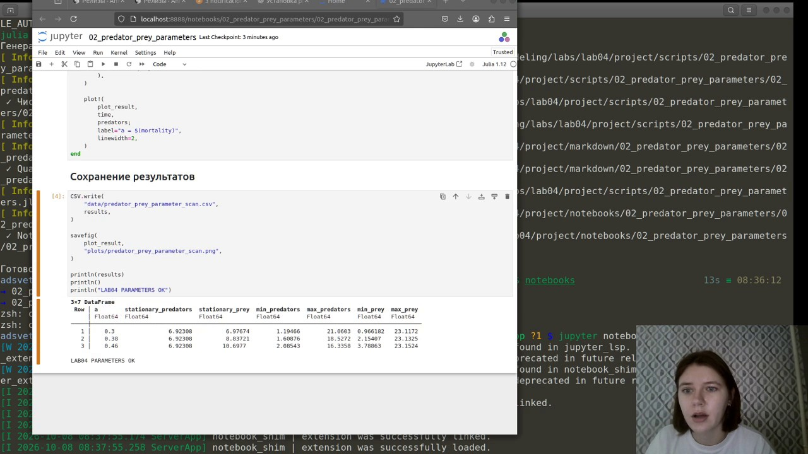

---
author:
  name: Анна Светцова
  email: 1132230807@pfur.ru
  affiliation:
    - name: Российский университет дружбы народов
      country: Российская Федерация
      city: Москва

title: "Лабораторная работа № 4"
subtitle: "Модель «хищник–жертва»"
license: CC BY

execute:
  enabled: false
---

# Цель работы

Исследовать классическую модель Лотки–Вольтерры «хищник–жертва» для варианта 58: построить временные зависимости численности обеих популяций, фазовый портрет, определить стационарное состояние и провести параметрическое исследование.

# Задание

Для варианта 58 задана система

$$
\frac{dx}{dt}=-0.38x+0.043xy,
$$

$$
\frac{dy}{dt}=0.36y-0.052xy,
$$

где $x(t)$ — численность хищников, а $y(t)$ — численность жертв.

Начальные условия:

$$
x(0)=6,\qquad y(0)=23.
$$

Необходимо:

- построить графики $x(t)$ и $y(t)$;
- построить зависимость численности хищников от численности жертв;
- найти стационарное состояние системы;
- выполнить дополнительное параметрическое исследование.

# Теоретические сведения

Классическая модель Лотки–Вольтерры описывает взаимодействие двух популяций:

$$
\frac{dx}{dt}=-ax+bxy,
$$

$$
\frac{dy}{dt}=cy-dxy.
$$

При отсутствии жертв численность хищников уменьшается. При отсутствии хищников численность жертв увеличивается. Члены, содержащие произведение $xy$, описывают встречи между двумя популяциями: они способствуют росту числа хищников и одновременно уменьшают число жертв.

Для ненулевого стационарного состояния обе производные должны быть равны нулю. Отсюда

$$
x^*=\frac{c}{d},
\qquad
y^*=\frac{a}{b}.
$$

Для коэффициентов варианта 58:

$$
x^*=\frac{0.36}{0.052}\approx6.923,
$$

$$
y^*=\frac{0.38}{0.043}\approx8.837.
$$

# Реализация вычислительного эксперимента

Расчёт выполнен на языке Julia с использованием `DifferentialEquations.jl`. Система решается численно методом `Tsit5`. Для построения графиков используется `Plots.jl`, результаты сохраняются в CSV с помощью `CSV.jl` и `DataFrames.jl`.

На скриншоте показан успешный основной запуск.

{width=94%}

Программа завершилась сообщением `LAB04 BASE OK`. Для базового варианта получено стационарное состояние

$$
(x^*,y^*)\approx(6.923,\;8.837).
$$

Численные экстремумы основного решения:

| Величина | Значение |
|---|---:|
| Минимум хищников | 1.60876 |
| Максимум хищников | 18.5272 |
| Минимум жертв | 2.15407 |
| Максимум жертв | 23.1325 |

# Результаты основного эксперимента

## Изменение численности популяций

{width=88%}

Численности хищников и жертв совершают периодические колебания. Рост численности жертв создаёт условия для последующего роста популяции хищников. Увеличение числа хищников, в свою очередь, приводит к снижению численности жертв, после чего начинает уменьшаться и число хищников.

## Фазовый портрет

{width=88%}

Фазовая траектория представляет собой замкнутый цикл вокруг стационарной точки. Это соответствует периодическому характеру жёсткой модели Лотки–Вольтерры.

## Численность хищников

{width=84%}

## Численность жертв

{width=84%}

# Параметрическое исследование

Дополнительно исследовано влияние коэффициента естественной смертности хищников $a$.

Использованы значения

$$
a\in\{0.30,\;0.38,\;0.46\}.
$$

Остальные параметры и начальные условия оставлены неизменными.

При изменении $a$ стационарная численность хищников

$$
x^*=\frac{c}{d}
$$

не изменяется, а стационарная численность жертв

$$
y^*=\frac{a}{b}
$$

меняется вместе с коэффициентом смертности.

{width=88%}

Полученные значения:

| $a$ | $x^*$ | $y^*$ | min $x$ | max $x$ | min $y$ | max $y$ |
|---:|---:|---:|---:|---:|---:|---:|
| 0.30 | 6.92308 | 6.97674 | 1.19466 | 21.0603 | 0.966182 | 23.1172 |
| 0.38 | 6.92308 | 8.83721 | 1.60876 | 18.5272 | 2.15407 | 23.1325 |
| 0.46 | 6.92308 | 10.6977 | 2.08543 | 16.3358 | 3.78863 | 23.1524 |

Увеличение коэффициента смертности хищников смещает равновесную численность жертв вверх и изменяет амплитуду колебаний популяций.

# Литературное программирование

Исходный код оформлен в литературном стиле. Из исходников автоматически сформированы:

- чистый Julia-код;
- Jupyter Notebook;
- документация Quarto.

В ходе проверки параметрического notebook была обнаружена проблема разбиения цикла на несколько ячеек. Структура литературного исходника была исправлена, после чего notebook был сгенерирован повторно и успешно выполнен.

# Выполнение Jupyter Notebook

Основной notebook успешно выполнен в отдельном окружении лабораторной работы.

{width=94%}

Ниже показан параметрический notebook.

{width=94%}

После исправления структуры исходника параметрический notebook также завершился сообщением `LAB04 PARAMETERS OK`.

{width=94%}

# Документация Quarto

Документация основного эксперимента:



Документация параметрического исследования:



# Результаты

В ходе лабораторной работы:

- реализована модель Лотки–Вольтерры для варианта 58;
- построены графики изменения численности хищников и жертв;
- построен фазовый портрет;
- найдено ненулевое стационарное состояние;
- выполнено параметрическое исследование коэффициента смертности хищников;
- основной и параметрический эксперименты представлены в воспроизводимом виде;
- сформированы Julia, Jupyter и Quarto-представления вычислений.

# Вывод

Для варианта 58 получены периодические колебания численности хищников и жертв. Фазовая траектория замкнута вокруг стационарной точки

$$
(x^*,y^*)\approx(6.923,\;8.837).
$$

Параметрическое исследование показало, что изменение естественной смертности хищников существенно влияет на амплитуду колебаний и изменяет стационарную численность жертв. При этом стационарная численность хищников при выбранном параметрическом изменении остаётся постоянной.
