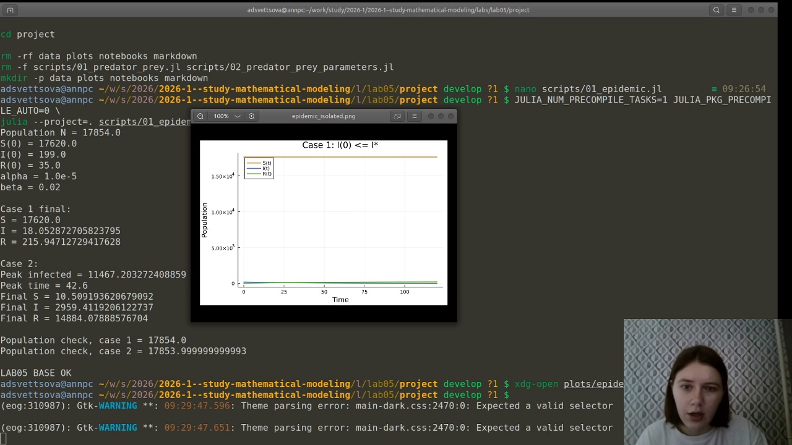
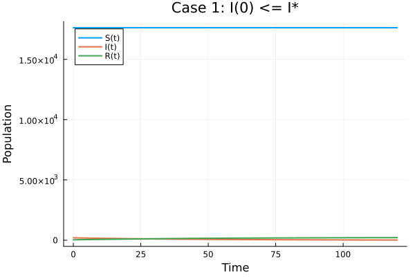
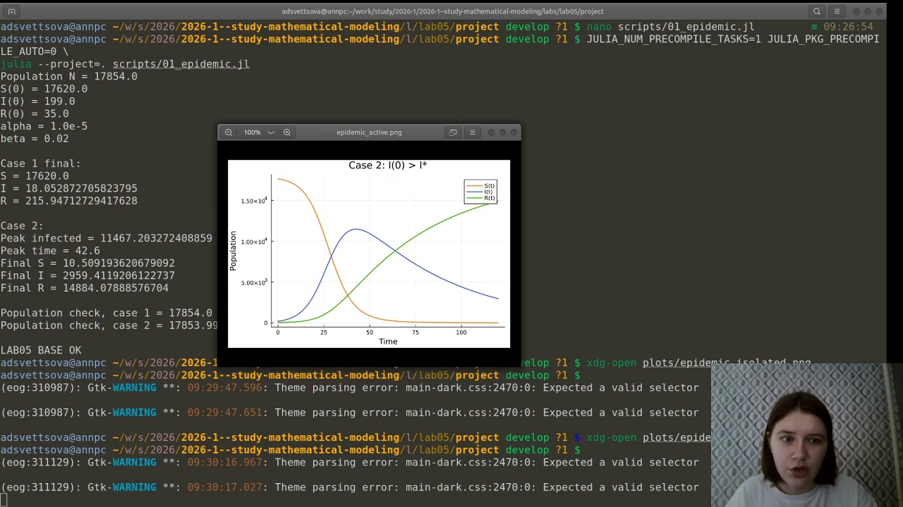
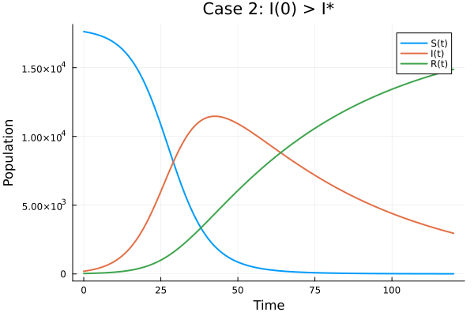
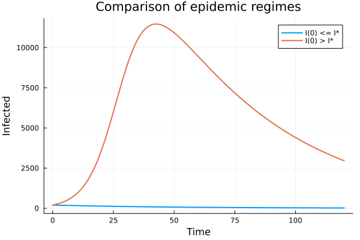
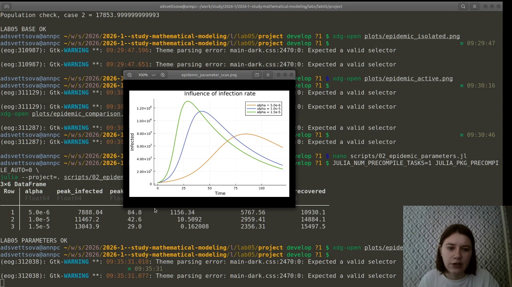
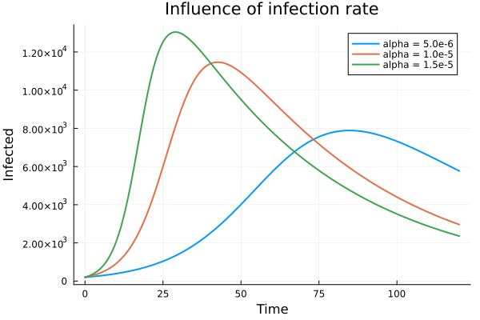
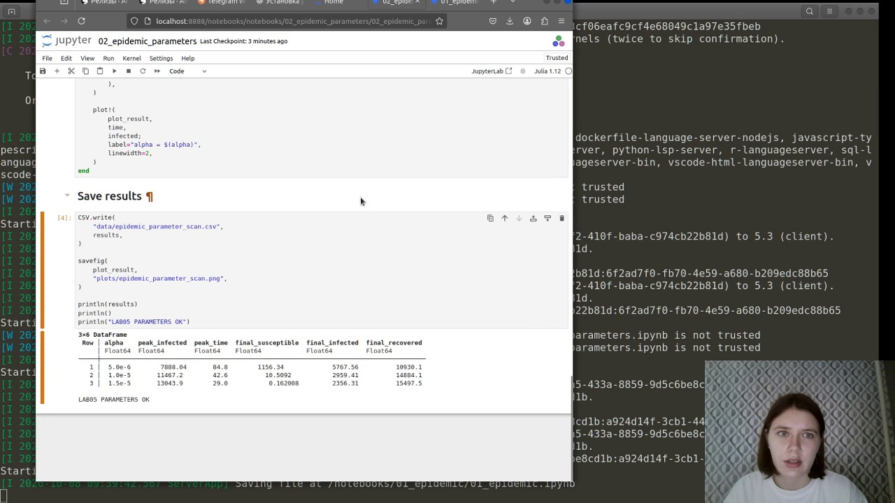

---
author:
  name: Анна Светцова
  email: 1132230807@pfur.ru
  affiliation:
    - name: Российский университет дружбы народов
      country: Российская Федерация
      city: Москва

title: "Лабораторная работа № 5"
subtitle: "Задача об эпидемии"
license: CC BY

execute:
  enabled: false
---

# Цель работы

Исследовать простейшую модель эпидемии для варианта 58, построить динамику численности восприимчивых, инфицированных и людей с иммунитетом для двух режимов распространения инфекции, а также провести параметрическое исследование коэффициента заболеваемости.

# Задание

Население изолированной территории разбивается на три группы:

- $S(t)$ — восприимчивые к болезни, но пока здоровые;
- $I(t)$ — инфицированные и распространяющие инфекцию;
- $R(t)$ — здоровые люди с иммунитетом.

Для варианта 58 заданы:

$$
N=17854,\qquad I(0)=199,\qquad R(0)=35.
$$

Следовательно,

$$
S(0)=N-I(0)-R(0)=17620.
$$

Необходимо построить графики изменения численности всех трёх групп и сравнить два случая:

1. $I(0)\le I^*$ — заболевшие изолированы и не заражают восприимчивых;
2. $I(0)>I^*$ — инфекция распространяется среди восприимчивой части населения.

В вычислительном эксперименте используются коэффициенты

$$
\alpha=10^{-5},\qquad \beta=0.02,
$$

где $\alpha$ — коэффициент заболеваемости, а $\beta$ — коэффициент выздоровления.

# Теоретические сведения

## Случай $I(t)\le I^*$

Если число инфицированных не превышает критическое значение, больные считаются изолированными. Новых заражений нет:

$$
\frac{dS}{dt}=0,
$$

$$
\frac{dI}{dt}=-\beta I,
$$

$$
\frac{dR}{dt}=\beta I.
$$

Восприимчивая часть населения остаётся постоянной, инфицированные постепенно выздоравливают, а группа с иммунитетом увеличивается.

## Случай $I(t)>I^*$

Если число инфицированных превышает критическое значение, возникает распространение инфекции:

$$
\frac{dS}{dt}=-\alpha SI,
$$

$$
\frac{dI}{dt}=\alpha SI-\beta I,
$$

$$
\frac{dR}{dt}=\beta I.
$$

Член $\alpha SI$ описывает новые заражения, а $\beta I$ — переход инфицированных в группу людей с иммунитетом.

Для обоих режимов выполняется закон сохранения:

$$
S(t)+I(t)+R(t)=N.
$$

# Реализация основного эксперимента

Расчёт выполнен на Julia с использованием пакета `DifferentialEquations.jl` и метода `Tsit5`. Результаты сохраняются в CSV, а графики — в PNG.

## Режим с изоляцией

На скриншоте показан успешный запуск модели для случая $I(0)\le I^*$.

{width=94%}

Получено:

- $S(120)=17620$;
- $I(120)\approx18.053$;
- $R(120)\approx215.947$.

Сумма трёх групп равна исходной численности населения:

$$
S+I+R=17854.
$$

График:

{width=88%}

При изоляции инфицированных новых заражений нет, поэтому $S(t)$ остаётся постоянной, $I(t)$ монотонно уменьшается, а $R(t)$ увеличивается.

## Режим активного распространения

На следующем скриншоте показан второй режим.

{width=94%}

Максимальное число инфицированных:

$$
I_{\max}\approx11467.20,
$$

которое достигается примерно при

$$
t\approx42.6.
$$

К концу интервала моделирования:

$$
S(120)\approx10.509,
$$

$$
I(120)\approx2959.412,
$$

$$
R(120)\approx14884.079.
$$

График:

{width=88%}

В этом режиме сначала наблюдается быстрый рост числа инфицированных. После существенного уменьшения числа восприимчивых скорость новых заражений снижается, достигается эпидемический пик и начинается спад.

## Сравнение режимов

{width=88%}

Два режима качественно различаются: при изоляции число заболевших постепенно уменьшается, а при активном распространении формируется выраженная эпидемическая волна.

# Параметрическое исследование

Дополнительно исследовано влияние коэффициента заболеваемости $\alpha$.

Использованы значения:

$$
\alpha\in\{0.5\cdot10^{-5},\;1.0\cdot10^{-5},\;1.5\cdot10^{-5}\}.
$$

Коэффициент выздоровления $\beta=0.02$ и начальные условия остаются неизменными.

{width=94%}

{width=88%}

Полученные характеристики:

| $\alpha$ | Пик $I$ | Время пика | Итоговое $S$ | Итоговое $I$ | Итоговое $R$ |
|---:|---:|---:|---:|---:|---:|
| $0.5\cdot10^{-5}$ | 7888.04 | 84.8 | 1156.34 | 5767.56 | 10930.1 |
| $1.0\cdot10^{-5}$ | 11467.2 | 42.6 | 10.5092 | 2959.41 | 14884.1 |
| $1.5\cdot10^{-5}$ | 13043.9 | 29.0 | 0.162008 | 2356.31 | 15497.5 |

С ростом коэффициента заболеваемости пик числа инфицированных увеличивается и наступает раньше. При этом к концу рассматриваемого интервала остаётся меньше восприимчивых людей.

# Литературное программирование и воспроизводимость

Исходный код оформлен в литературном стиле. Из него автоматически сформированы:

- чистые Julia-скрипты;
- Jupyter Notebook;
- документация Quarto.

Параметрический notebook успешно выполнен в отдельном окружении лабораторной работы.

{width=94%}

Расчёт завершился сообщением `LAB05 PARAMETERS OK`.

# Документация Quarto

Основной вычислительный эксперимент:



Параметрическое исследование:



# Результаты

В ходе выполнения лабораторной работы:

- реализована эпидемическая модель для варианта 58;
- рассмотрены два режима относительно критического числа инфицированных;
- построены графики $S(t)$, $I(t)$ и $R(t)$;
- найден максимум числа инфицированных для активного режима;
- проверено сохранение общей численности населения;
- выполнено параметрическое исследование коэффициента заболеваемости;
- сформированы Julia, Jupyter и Quarto-представления вычислений.

# Вывод

При условии изоляции заболевших инфекция постепенно затухает: новых случаев не возникает, а инфицированные переходят в группу людей с иммунитетом.

Если число инфицированных превышает критическое значение и начинается активное распространение, возникает эпидемическая волна. Для выбранных параметров максимальное число инфицированных составляет примерно 11467 человек и достигается около момента времени 42.6.

Параметрическое исследование показало, что увеличение коэффициента заболеваемости приводит к более высокому и более раннему пику эпидемии.
