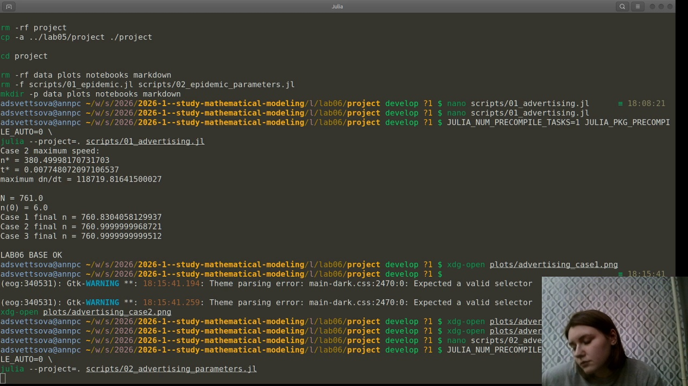
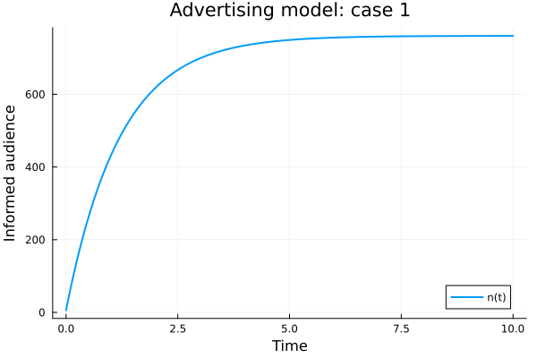
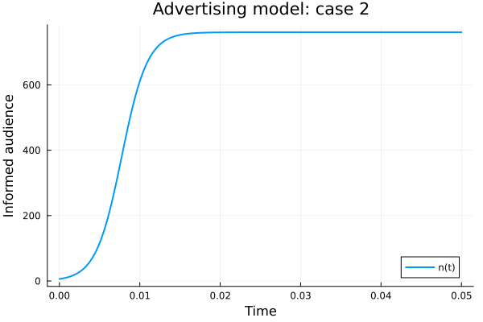
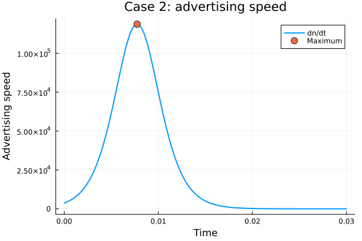
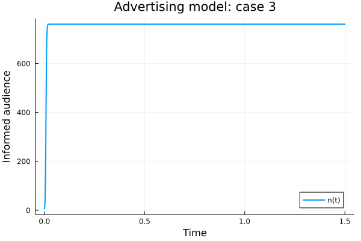
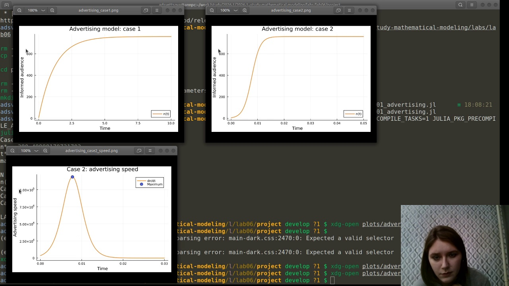
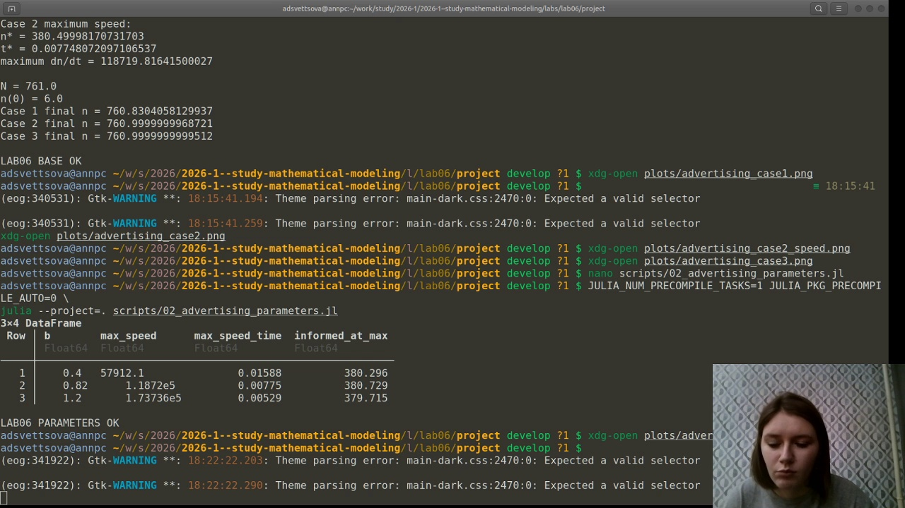
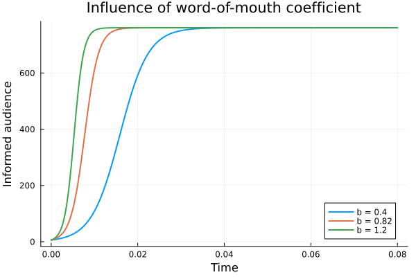
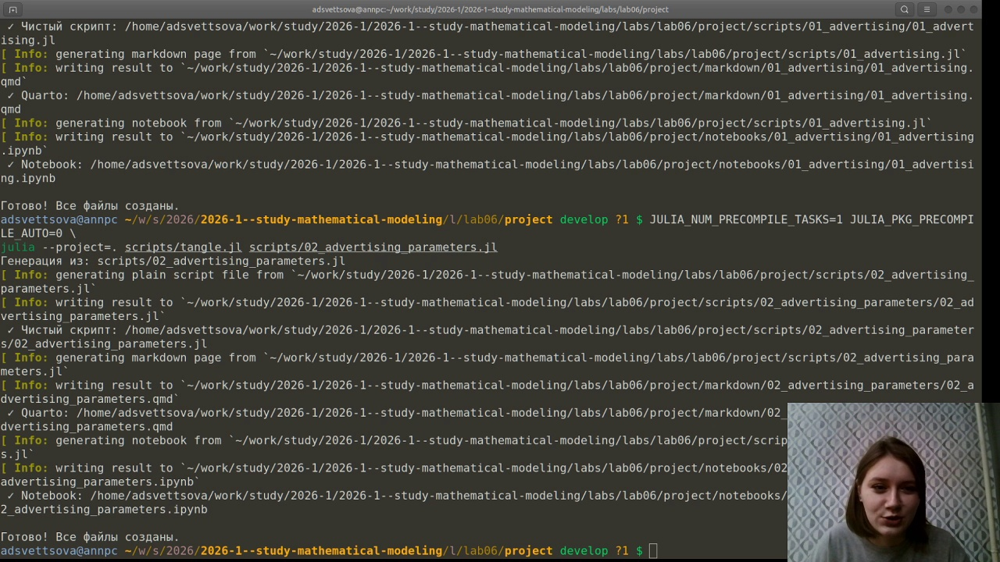
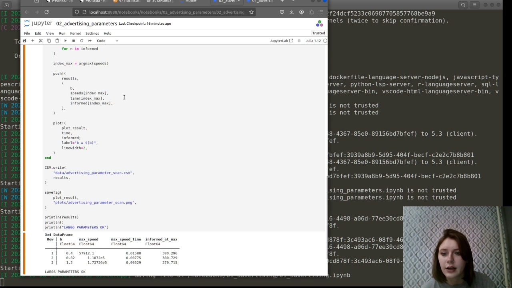

---
author:
  name: Анна Светцова
  email: 1132230807@pfur.ru
  affiliation:
    - name: Российский университет дружбы народов
      country: Российская Федерация
      city: Москва

title: "Лабораторная работа № 6"
subtitle: "Модель распространения рекламы"
license: CC BY

execute:
  enabled: false
---

# Цель работы

Исследовать модель распространения рекламы для варианта 58, построить динамику числа информированных потребителей для трёх заданных моделей, определить момент максимальной скорости распространения рекламы во втором случае и выполнить параметрическое исследование влияния коэффициента сарафанного радио.

# Задание

Для варианта 58 общий объём потенциальной аудитории равен

$$
N=761,
$$

а в начальный момент времени о товаре знают

$$
n(0)=6
$$

человек.

Необходимо исследовать три модели:

$$
\frac{dn}{dt}=(0.82+0.00003n)(N-n),
$$

$$
\frac{dn}{dt}=(0.00003+0.82n)(N-n),
$$

$$
\frac{dn}{dt}=(0.2\sin t+0.8\cos(t)n)(N-n).
$$

Для второго случая требуется определить момент времени, в который скорость распространения рекламы максимальна.

# Теоретические сведения

Общая модель распространения рекламы имеет вид

$$
\frac{dn}{dt}
=
\left(\alpha_1(t)+\alpha_2(t)n(t)\right)
\left(N-n(t)\right).
$$

Здесь:

- $n(t)$ — число потребителей, уже знающих о товаре;
- $N-n(t)$ — число ещё не информированных потенциальных потребителей;
- $\alpha_1(t)$ характеризует вклад непосредственной рекламной кампании;
- $\alpha_2(t)n(t)$ описывает распространение информации уже информированными потребителями, то есть эффект сарафанного радио.

По мере роста $n(t)$ число людей, способных передавать информацию другим, увеличивается, но одновременно уменьшается число ещё не информированных потребителей.

# Реализация модели

Вычисления выполнены на Julia с использованием `DifferentialEquations.jl`. Для решения задач Коши применяется метод `Tsit5`.

Основные результаты выполнения программы показаны на скриншоте.

{width=96%}

Для базовых моделей получены следующие итоговые значения:

- случай 1: $n(10)\approx760.8304$;
- случай 2: $n(0.05)\approx761$;
- случай 3: $n(1.5)\approx761$.

Во всех случаях число информированных стремится к предельному размеру аудитории $N=761$.

# Первый случай

Модель имеет вид

$$
\frac{dn}{dt}
=
(0.82+0.00003n)(N-n).
$$

Здесь основную роль играет постоянный вклад непосредственной рекламы, тогда как коэффициент сарафанного радио значительно меньше.

{width=82%}

Число информированных быстро увеличивается, а затем рост замедляется по мере насыщения аудитории.

# Второй случай

Модель:

$$
\frac{dn}{dt}
=
(0.00003+0.82n)(N-n).
$$

В этом случае постоянный рекламный вклад мал, а основной рост формируется за счёт уже информированных потребителей.

{width=82%}

Характер решения близок к логистическому: сначала скорость распространения увеличивается, затем после достижения определённого уровня начинает снижаться.

# Максимальная скорость распространения

Для второго случая обозначим

$$
v(n)=(a+bn)(N-n),
$$

где

$$
a=0.00003,\qquad b=0.82.
$$

После раскрытия скобок функция $v(n)$ является квадратичной параболой с ветвями вниз. Максимум достигается при

$$
n_*=\frac{bN-a}{2b}.
$$

Для варианта 58:

$$
n_*\approx380.500.
$$

Соответствующий момент времени:

$$
t_*\approx0.007748.
$$

Максимальная скорость:

$$
\left(\frac{dn}{dt}\right)_{\max}
\approx118719.82.
$$

{width=82%}

Таким образом, максимальная скорость достигается примерно тогда, когда реклама охватывает половину потенциальной аудитории.

# Третий случай

Модель имеет вид

$$
\frac{dn}{dt}
=
(0.2\sin t+0.8\cos(t)n)(N-n).
$$

В отличие от первых двух случаев, интенсивность рекламного воздействия и вклад сарафанного радио зависят от времени.

{width=82%}

Поэтому скорость изменения аудитории определяется не только текущим количеством информированных людей, но и текущим моментом времени.

# Сравнение результатов

На записи выполнения были одновременно рассмотрены графики первого и второго случаев и график скорости распространения во втором случае.

{width=96%}

Первый случай характеризуется быстрым ростом под действием непосредственной рекламы. Во втором случае выраженный S-образный рост связан с сильным эффектом сарафанного радио.

# Параметрическое исследование

Для дополнительного исследования используется модель

$$
\frac{dn}{dt}=(a+bn)(N-n),
$$

где

$$
a=0.00003,
$$

а коэффициент сарафанного радио принимает значения

$$
b\in\{0.4,\;0.82,\;1.2\}.
$$

Полученные результаты:

| $b$ | Максимальная скорость | Время максимума | $n$ в момент максимума |
|---:|---:|---:|---:|
| 0.40 | 57912.1 | 0.01588 | 380.296 |
| 0.82 | $1.1872\cdot10^5$ | 0.00775 | 380.729 |
| 1.20 | $1.73736\cdot10^5$ | 0.00529 | 379.715 |

{width=96%}

{width=82%}

С увеличением коэффициента сарафанного радио максимальная скорость распространения рекламы возрастает, а момент достижения максимальной скорости наступает раньше.

# Литературное программирование

Исходные программы оформлены в литературном стиле. Из них автоматически сформированы:

- чистые Julia-скрипты;
- документация Quarto;
- Jupyter Notebook.

Процесс генерации производных форматов показан на скриншоте.

{width=96%}

# Проверка воспроизводимости

Сформированные Jupyter Notebook были выполнены в отдельном окружении лабораторной работы.

{width=96%}

Параметрический расчёт завершился сообщением

`LAB06 PARAMETERS OK`.

# Документация Quarto

Основной вычислительный эксперимент:



Параметрическое исследование:



# Результаты

В ходе работы:

- реализованы три модели распространения рекламы для варианта 58;
- построены графики изменения числа информированных потребителей;
- для второго случая найден момент максимальной скорости распространения;
- построен отдельный график скорости;
- выполнено параметрическое исследование коэффициента сарафанного радио;
- сформированы Julia, Jupyter и Quarto-представления вычислений.

# Вывод

Все три модели приводят к постепенному охвату почти всей потенциальной аудитории, однако характер распространения существенно зависит от соотношения вкладов непосредственной рекламы и сарафанного радио.

Во втором случае максимальная скорость распространения достигается примерно в момент

$$
t\approx0.00775
$$

при охвате около половины аудитории.

Параметрическое исследование показало, что увеличение коэффициента сарафанного радио ускоряет распространение информации, увеличивает максимальную скорость роста аудитории и приводит к более раннему достижению её максимума.
