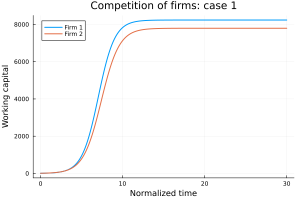
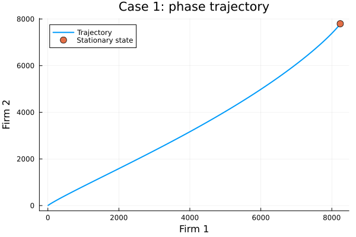
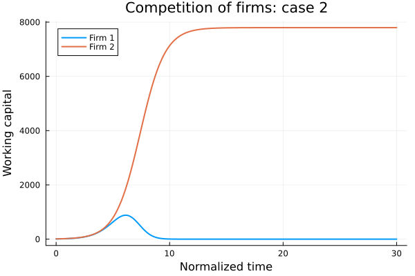
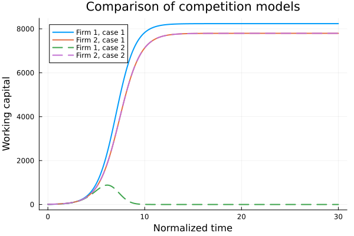
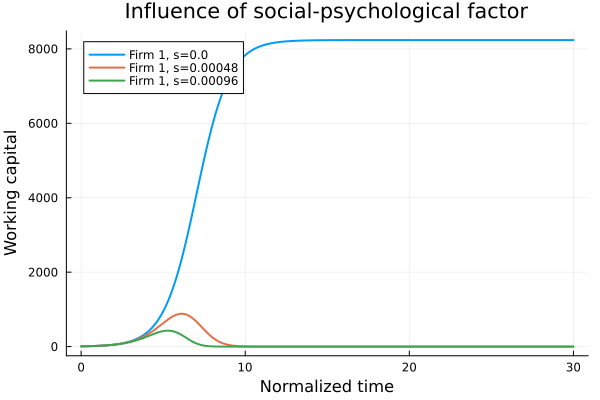

---
author:
  - name: Анна Светцова
    email: 1132230807@pfur.ru
    affiliation:
      - name: Российский университет дружбы народов
title: "Лабораторная работа № 7"
subtitle: "Модель конкуренции двух фирм"
license: CC BY
date: today
date-format: "YYYY-MM-DD"
---

# Информация

## Докладчик

**Анна Светцова**

Российский университет дружбы народов

1132230807@pfur.ru

# Вводная часть

## Актуальность

- Математические модели позволяют исследовать конкурентную борьбу фирм
- На результат влияют себестоимость, производственный цикл и взаимодействие участников рынка
- Дополнительные социально-психологические факторы могут существенно изменить устойчивость системы

## Цель работы

Исследовать модель конкуренции двух фирм для варианта 58:

- построить динамику оборотных средств двух фирм;
- сравнить два режима конкуренции;
- найти стационарное состояние первого случая;
- исследовать влияние социально-психологического коэффициента.

# Постановка задачи

## Исходные условия

Начальные оборотные средства:

$$
M_1(0)=7.2,\qquad M_2(0)=9.1.
$$

Параметры рынка:

$$
p_{cr}=42,\qquad N=45,\qquad q=1.
$$

## Параметры фирм

Для первой фирмы:

$$
\tau_1=28,\qquad \tilde p_1=8.1.
$$

Для второй фирмы:

$$
\tau_2=22,\qquad \tilde p_2=10.5.
$$

# Коэффициенты модели

## Расчёт коэффициентов

В модели используются коэффициенты

$$
a_1=
\frac{p_{cr}}
{\tau_1^2\tilde p_1^2Nq},
\qquad
a_2=
\frac{p_{cr}}
{\tau_2^2\tilde p_2^2Nq},
$$

$$
b=
\frac{p_{cr}}
{\tau_1^2\tau_2^2\tilde p_1^2\tilde p_2^2Nq}.
$$

## Коэффициенты роста

$$
c_1=
\frac{p_{cr}-\tilde p_1}{\tau_1\tilde p_1},
\qquad
c_2=
\frac{p_{cr}-\tilde p_2}{\tau_2\tilde p_2}.
$$

Численно:

$$
c_1\approx0.14947,\qquad
c_2\approx0.13636.
$$

# Первый случай

## Экономическая конкуренция

$$
\frac{dM_1}{d\theta}
=
M_1-
\frac{b}{c_1}M_1M_2-
\frac{a_1}{c_1}M_1^2,
$$

$$
\frac{dM_2}{d\theta}
=
\frac{c_2}{c_1}M_2-
\frac{b}{c_1}M_1M_2-
\frac{a_2}{c_1}M_2^2.
$$

## Динамика первого случая

{width=82%}

При учёте только экономических факторов обе фирмы выходят на устойчивые положительные уровни оборотных средств.

# Стационарное состояние

## Условие равновесия

Для положительного стационарного решения:

$$
a_1M_1+bM_2=c_1,
$$

$$
bM_1+a_2M_2=c_2.
$$

## Результат

Получено:

$$
M_1^*\approx8237.55,
$$

$$
M_2^*\approx7796.09.
$$

## Фазовая траектория

{width=82%}

Траектория приближается к вычисленному стационарному состоянию.

# Второй случай

## Социально-психологический фактор

Для варианта 58 вводится дополнительный коэффициент

$$
s=0.00048.
$$

Первое уравнение становится

$$
\frac{dM_1}{d\theta}
=
M_1-
\left(
\frac{b}{c_1}+s
\right)M_1M_2-
\frac{a_1}{c_1}M_1^2.
$$

## Динамика второго случая

{width=82%}

Дополнительное воздействие резко ухудшает положение первой фирмы, тогда как вторая сохраняет устойчивый уровень.

# Сравнение моделей

## Общий график

{width=82%}

В первом случае обе фирмы сохраняются на рынке, во втором первая фирма практически вытесняется.

# Параметрическое исследование

## Изменяемый коэффициент

Исследуются значения:

$$
s\in\{0,\;0.00048,\;0.00096\}.
$$

Остальные параметры и начальные условия остаются неизменными.

## Результат исследования

{width=82%}

Даже небольшое дополнительное воздействие качественно меняет результат для первой фирмы.

## Численные результаты

| $s$ | Итоговое $M_1$ | Итоговое $M_2$ |
|---:|---:|---:|
| 0 | 8237.55 | 7796.09 |
| 0.00048 | $\approx0$ | 7796.25 |
| 0.00096 | $\approx0$ | 7796.25 |

# Воспроизводимость

## Организация вычислений

- модель реализована на Julia;
- использован `DifferentialEquations.jl`;
- решение получено методом `Tsit5`;
- данные сохранены в CSV;
- графики сохранены в PNG;
- сформированы Jupyter Notebook и Quarto-документация.

# Результаты

## Основные результаты

- исследованы два режима конкуренции;
- построена динамика оборотных средств двух фирм;
- найдено стационарное состояние первого случая;
- построена фазовая траектория;
- выполнено параметрическое исследование социально-психологического фактора.

# Итоги

## Вывод

При чисто экономической конкуренции обе фирмы достигают устойчивого положительного состояния.

Добавление социально-психологического фактора существенно меняет динамику и практически вытесняет первую фирму с рынка.

Модель показывает высокую чувствительность результата конкуренции к дополнительному коэффициенту взаимодействия.
