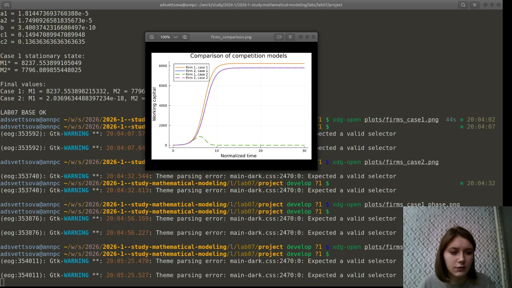
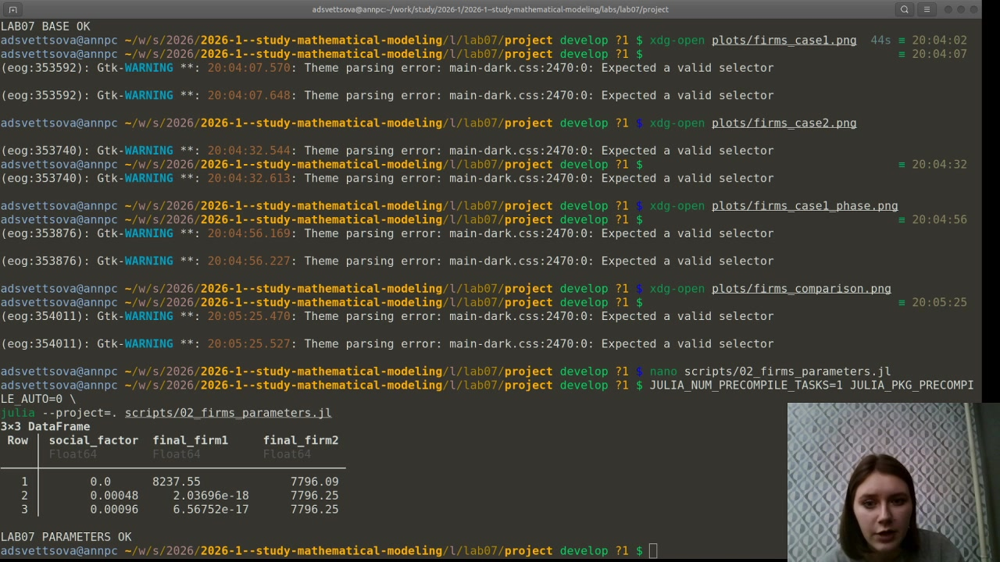
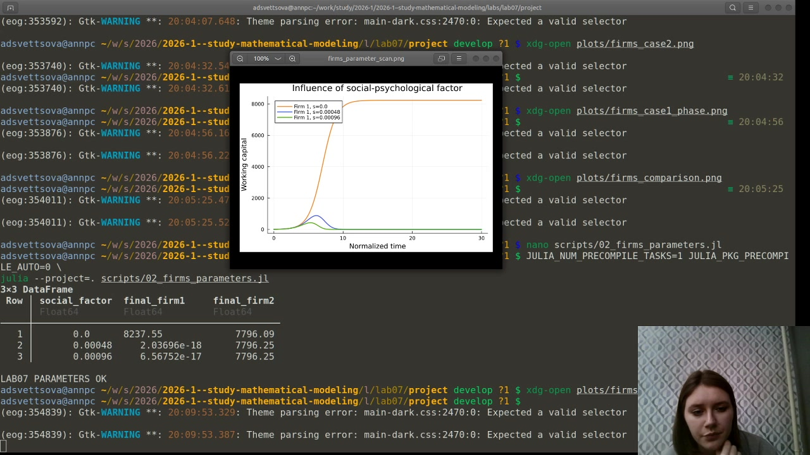
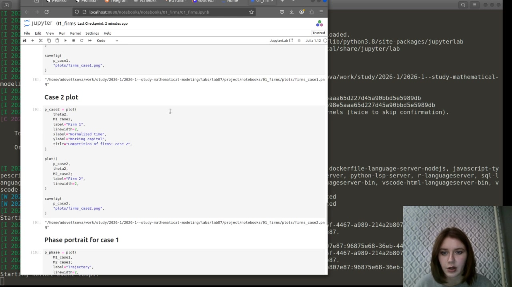

---
author:
  name: Анна Светцова
  email: 1132230807@pfur.ru
  affiliation:
    - name: Российский университет дружбы народов
      country: Российская Федерация
      city: Москва

title: "Лабораторная работа № 7"
subtitle: "Модель конкуренции двух фирм"
license: CC BY

execute:
  enabled: false
---

# Цель работы

Исследовать модель конкуренции двух фирм, производящих взаимозаменяемые товары в одной рыночной нише, для варианта 58. Необходимо сравнить два режима конкуренции, найти стационарное состояние первого случая и исследовать влияние дополнительного социально-психологического фактора.

# Исходные данные

Для варианта 58 заданы начальные значения оборотных средств

$$
M_1(0)=7.2,\qquad M_2(0)=9.1.
$$

Параметры модели:

$$
p_{cr}=42,\qquad N=45,\qquad q=1,
$$

$$
\tau_1=28,\qquad \tau_2=22,
$$

$$
\tilde p_1=8.1,\qquad \tilde p_2=10.5.
$$

Здесь $N$ — число потребителей, $\tau_i$ — длительность производственного цикла, $p_{cr}$ — критическая цена, $\tilde p_i$ — себестоимость продукции, $q$ — максимальная потребность одного потребителя.

# Коэффициенты модели

На основании исходных данных вычисляются коэффициенты

$$
a_1=
\frac{p_{cr}}
{\tau_1^2\tilde p_1^2Nq},
$$

$$
a_2=
\frac{p_{cr}}
{\tau_2^2\tilde p_2^2Nq},
$$

$$
b=
\frac{p_{cr}}
{\tau_1^2\tau_2^2\tilde p_1^2\tilde p_2^2Nq},
$$

$$
c_1=
\frac{p_{cr}-\tilde p_1}{\tau_1\tilde p_1},
\qquad
c_2=
\frac{p_{cr}-\tilde p_2}{\tau_2\tilde p_2}.
$$

В вычислительном эксперименте получены:

$$
a_1\approx1.81447\cdot10^{-5},
$$

$$
a_2\approx1.74909\cdot10^{-5},
$$

$$
b\approx3.40037\cdot10^{-10},
$$

$$
c_1\approx0.14947,
\qquad
c_2\approx0.13636.
$$

# Случай 1

В первом случае учитываются только экономические механизмы конкуренции. После введения нормированного времени система имеет вид

$$
\frac{dM_1}{d\theta}
=
M_1-
\frac{b}{c_1}M_1M_2-
\frac{a_1}{c_1}M_1^2,
$$

$$
\frac{dM_2}{d\theta}
=
\frac{c_2}{c_1}M_2-
\frac{b}{c_1}M_1M_2-
\frac{a_2}{c_1}M_2^2.
$$

Численное решение выполнено методом `Tsit5`.

{width=84%}

Обе фирмы увеличивают оборотные средства и постепенно приближаются к устойчивым значениям.

# Стационарное состояние первого случая

Для положительного стационарного решения выполняется система

$$
a_1M_1+bM_2=c_1,
$$

$$
bM_1+a_2M_2=c_2.
$$

Получено стационарное состояние

$$
M_1^*\approx8237.554,
$$

$$
M_2^*\approx7796.090.
$$

Фазовая траектория:

{width=82%}

Точка стационарного состояния отмечена отдельно.

# Случай 2

Во втором случае дополнительно учитывается социально-психологический фактор, влияющий на взаимодействие фирм. Для варианта 58 его коэффициент равен

$$
s=0.00048.
$$

Первое уравнение принимает вид

$$
\frac{dM_1}{d\theta}
=
M_1-
\left(
\frac{b}{c_1}+0.00048
\right)M_1M_2-
\frac{a_1}{c_1}M_1^2.
$$

Второе уравнение остаётся

$$
\frac{dM_2}{d\theta}
=
\frac{c_2}{c_1}M_2-
\frac{b}{c_1}M_1M_2-
\frac{a_2}{c_1}M_2^2.
$$

{width=84%}

При введении дополнительного воздействия оборотные средства первой фирмы после кратковременного роста резко уменьшаются и практически стремятся к нулю. Вторая фирма сохраняет высокий устойчивый уровень.

# Сравнение двух случаев

{width=84%}

На записи выполнения видны численные результаты и общий сравнительный график:

{width=96%}

К концу расчётного интервала:

- случай 1: $M_1\approx8237.55$, $M_2\approx7796.09$;
- случай 2: $M_1\approx2.04\cdot10^{-18}$, $M_2\approx7796.25$.

Таким образом, даже сравнительно небольшой дополнительный коэффициент в члене взаимодействия качественно меняет положение первой фирмы.

# Параметрическое исследование

Для оценки влияния социально-психологического фактора были рассмотрены значения

$$
s\in\{0,\;0.00048,\;0.00096\}.
$$

Для каждого значения система решалась с одинаковыми исходными параметрами.

{width=96%}

Численные результаты:

| $s$ | Итоговое $M_1$ | Итоговое $M_2$ |
|---:|---:|---:|
| 0 | 8237.55 | 7796.09 |
| 0.00048 | $2.04\cdot10^{-18}$ | 7796.25 |
| 0.00096 | $6.57\cdot10^{-17}$ | 7796.25 |

График параметрического исследования:

{width=96%}

{width=84%}

При отсутствии дополнительного воздействия первая фирма достигает устойчивого высокого уровня. При ненулевом социально-психологическом коэффициенте её оборотные средства после начального подъёма быстро уменьшаются практически до нуля.

# Литературное программирование и воспроизводимость

Исходные программы оформлены в литературном стиле. Из них автоматически формируются:

- Julia-скрипты;
- документация Quarto;
- Jupyter Notebook.

Один из выполненных notebook показан на записи:

{width=96%}

# Документация Quarto

Основной вычислительный эксперимент:



Параметрическое исследование:



# Результаты

В ходе лабораторной работы:

- реализованы два режима конкуренции фирм для варианта 58;
- построены графики оборотных средств обеих фирм;
- найдено стационарное состояние первого случая;
- построена фазовая траектория;
- проведено сравнение двух моделей;
- исследовано влияние социально-психологического коэффициента;
- подготовлены воспроизводимые Julia, Jupyter и Quarto-материалы.

# Вывод

В первом случае, когда конкуренция определяется только экономическими факторами, обе фирмы выходят на положительное устойчивое состояние:

$$
M_1^*\approx8237.55,\qquad
M_2^*\approx7796.09.
$$

Во втором случае дополнительный социально-психологический фактор существенно ухудшает положение первой фирмы: её оборотные средства практически стремятся к нулю, тогда как вторая фирма сохраняет устойчивое положение.

Параметрическое исследование подтверждает высокую чувствительность результата конкурентной борьбы к дополнительному коэффициенту взаимодействия.
